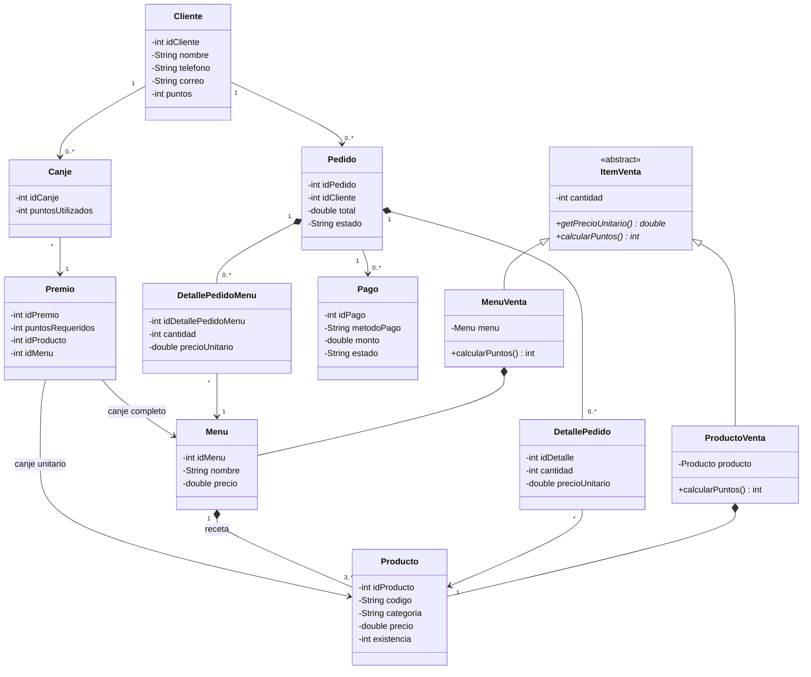

# Diagrama de clases

```mermaid
classDiagram
    class Cliente {
      -int idCliente
      -String nombre
      -String telefono
      -String correo
      -int puntos
    }
    class Pedido {
      -int idPedido
      -int idCliente
      -double total
      -String estado
    }
    class ItemVenta {
      <<abstract>>
      -int cantidad
      +getPrecioUnitario()* double
      +calcularPuntos()* int
    }
    class ProductoVenta {
      -Producto producto
      +calcularPuntos() int
    }
    class MenuVenta {
      -Menu menu
      +calcularPuntos() int
    }
    class Producto {
      -int idProducto
      -String codigo
      -String categoria
      -double precio
      -int existencia
    }
    class Menu {
      -int idMenu
      -String nombre
      -double precio
    }
    class DetallePedido {
      -int idDetalle
      -int cantidad
      -double precioUnitario
    }
    class DetallePedidoMenu {
      -int idDetallePedidoMenu
      -int cantidad
      -double precioUnitario
    }
    class Pago {
      -int idPago
      -String metodoPago
      -double monto
      -String estado
    }
    class Premio {
      -int idPremio
      -int puntosRequeridos
      -int idProducto
      -int idMenu
    }
    class Canje {
      -int idCanje
      -int puntosUtilizados
    }
    ItemVenta <|-- ProductoVenta
    ItemVenta <|-- MenuVenta
    ProductoVenta *-- Producto
    MenuVenta *-- Menu
    Cliente "1" --> "0..*" Pedido
    Pedido "1" *-- "0..*" DetallePedido
    Pedido "1" *-- "0..*" DetallePedidoMenu
    Pedido "1" --> "0..*" Pago
    DetallePedido "*" --> "1" Producto
    DetallePedidoMenu "*" --> "1" Menu
    Menu "1" *-- "3..*" Producto : receta
    Cliente "1" --> "0..*" Canje
    Canje "*" --> "1" Premio
    Premio --> Producto : canje unitario
    Premio --> Menu : canje completo
```
