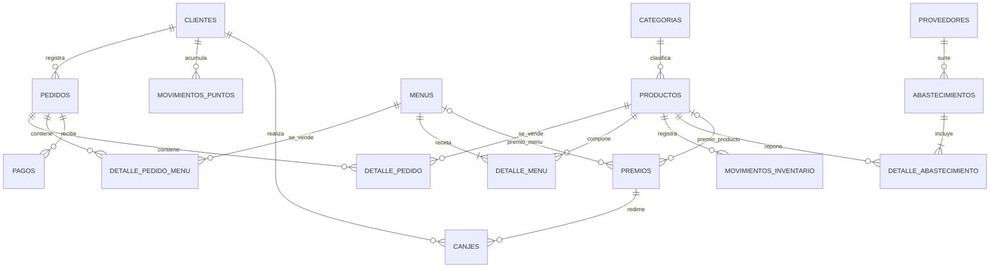

# Diagrama entidad-relación

```mermaid
erDiagram
    CLIENTES ||--o{ PEDIDOS : registra
    CLIENTES ||--o{ MOVIMIENTOS_PUNTOS : acumula
    CLIENTES ||--o{ CANJES : realiza
    PEDIDOS ||--o{ DETALLE_PEDIDO : contiene
    PEDIDOS ||--o{ DETALLE_PEDIDO_MENU : contiene
    PEDIDOS ||--o{ PAGOS : recibe
    PRODUCTOS ||--o{ DETALLE_PEDIDO : se_vende
    MENUS ||--o{ DETALLE_PEDIDO_MENU : se_vende
    MENUS ||--|{ DETALLE_MENU : receta
    PRODUCTOS ||--o{ DETALLE_MENU : compone
    CATEGORIAS ||--o{ PRODUCTOS : clasifica
    PRODUCTOS ||--o{ MOVIMIENTOS_INVENTARIO : registra
    PROVEEDORES ||--o{ ABASTECIMIENTOS : surte
    ABASTECIMIENTOS ||--|{ DETALLE_ABASTECIMIENTO : incluye
    PRODUCTOS ||--o{ DETALLE_ABASTECIMIENTO : repone
    PREMIOS ||--o{ CANJES : redime
    PRODUCTOS o|--o{ PREMIOS : premio_producto
    MENUS o|--o{ PREMIOS : premio_menu
```
